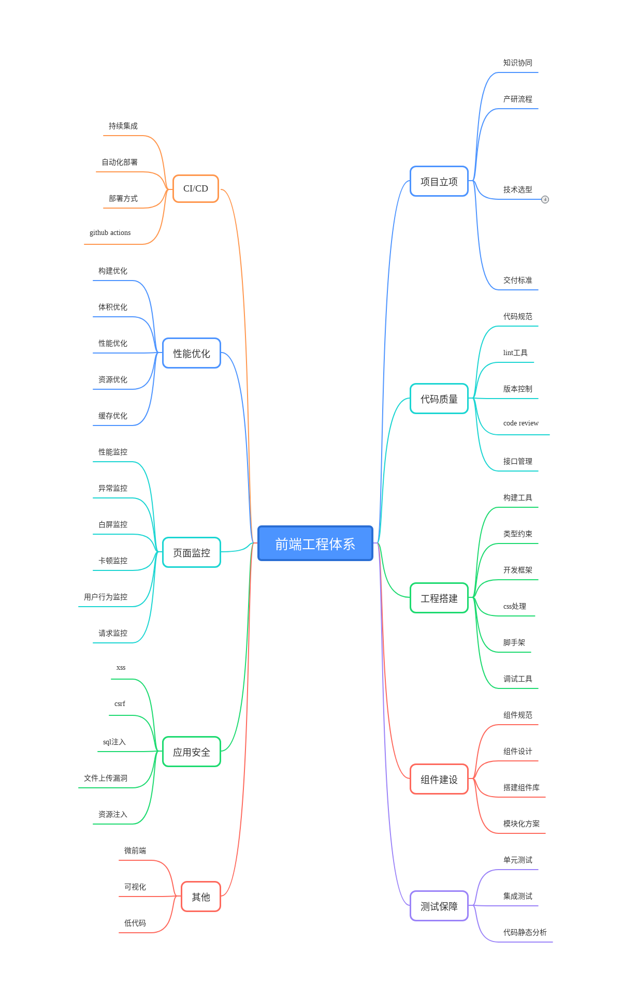

# 前端工程化详解

随着前端发展的不断壮大，`前端工程化`这个词被大家越来越多的提起，部门规划必做项，面试必问项。在目前大环境下不知道`前端工程化`已然不是一名合格的前端。

那么问题来了
- 什么是`前端工程化`？
- 为什么需要它？
- 作为一名开发同学，我能用它来做什么？
- 作为前端leader，我如何在部门的项目中如何开展工程化？

本小册通过对项目从零开始，针对产研流程，从项目立项、代码质量、工程搭建、组件建设、测试保障、CI/CD、性能优化、页面监控、应用安全等方面梳理前端工程化，跟大家共同探究上述问题
## 适宜人群
  - 初学前端，想了解前端工程化
  - 前端开发，提升自己对前端工程化的了解
  - 前端leader，对项目查漏补缺

## 访问地址
### 在线访问
[在线地址](http://guide.duanhl.com/)
### 本地访问
此方法依赖`git`、`node`

```
git clone https://github.com/CrayonPig/front-end-guide
cd ./front-end-guide
npm install 
npm run dev
```
浏览器访问 `http://localhost:8080/`

## 目录


## 进度
- [x] 项目立项
- [x] 代码质量
- [x] 代码规范
- [x] 工程搭建
- [ ] 组件建设
- [x] 测试保障
- [x] CI/CD
- [ ] 性能优化
- [ ] 页面监控
- [ ] 应用安全
- [ ] 其他
## 致谢（以下排名不分先后）
## License
MIT
