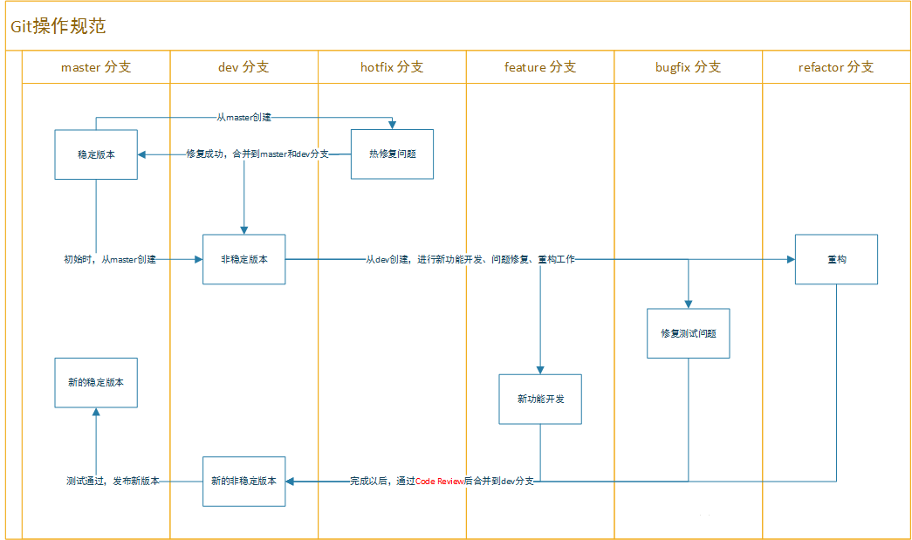

# Git 操作规范


## 常用的Git操作示例

假设现在当前需求为xxFunction，现在开始开发
```shell

# 新建分支：
git checkout dev      # 检出dev_version分支
git fetch origin dev         # 拉取远程仓库dev_version最新的代码
git checkout -b feature/xxFunction      # 基于dev_version 新建分支
git push origin feature/xxFunction      # 将新建的分支推送到远程仓库

# 开发过程：
git add .    # 将工作区的修改保存待提交。
git commit -m "type: 提交信息" # 将当前保存的修改整体作为一次commit进行提交，添加提交信息。此时本地的修改已经完成，等待推送到远程。

# 更新合并远程代码 ，如果commit在本地没有提交，使用rebase来合并其他代码，
git checkout dev    # 切换到当前版本分支
git pull    # 拉取远程代码
git checkout feature/xxFunction    # 切换到当前工作分支
git rebase dev    # 合并dev上的代码到当前工作分支

# rebase过程中可能出现冲突，需要手动修改代码来处理冲突，处理完成后：
git add .
git rebase —continue

# 如果处理冲突出错需要退出合并：
git rebase —abort

# 如果本地的commit已经push到远程，采用merge方式来合并其他分支的代码
git merge dev

# merge中产生冲突，先add 再commit 用一次commit来处理合并冲突

# 合并完成后，本地代码目前是包含了主分支代码及自己的开发代码，推送到远程
git push origin feature/xxFunction

# 然后在gitLab上提交一个合并请求，表明当前需求你的开发工作已经完成，想要合并入当前版本主分支:

# Source branch 选择你当前开发的分支 Target branch 选择你想要合入的分支 提交审核后，可以直接在gitLab页面上选择合并，一般来说之前处理过冲突的话，这里合并不会再产生冲突了

# 开发合并完成后，删除当前分支：
git checkout master   # 切换到其他分支，在当前分支时不能删除自身
git branch -d testBranch       # 删除本地分支
git push --delete origin testBranch     # 删除远程分支
```