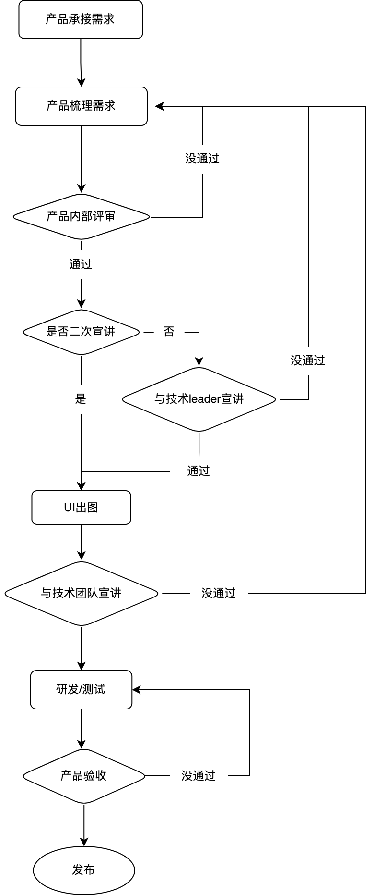

# 产研流程
我们大部分项目都会经历产品设计、研发、测试、发布几个阶段，我们一起来梳理下相关的研发流程

## 产品确定需求
产品的需求来源是各种各样的，一般包含但不局限于：
- 产品自身调研
- 运维\客服同事的反馈
- 技术迭代的需求
- 竞品
- 老板说必须有

产品所承接的大量需求，一般是杂乱而无序的，产品需要从繁杂的需求中，根据优先级和重要程度确定本次的需求列表

## 需求内审
在产品对已梳理完毕的需求内容确定好后，应在产品内部及需求承接方中，使用原型图的方式进行需求的内部评审。

此阶段应关注以下几点：
- 需求优先级和重要程度是否正确
- 产品所完善的是否能够解决问题
- 需求描述是否详尽
- 产品对于需求上线的心里预估时间

## 需求初审
产品完成需求内审后，应与技术leader、团队负责人进行初次评审。

此阶段应关注以下几点：
- 需求优先级和重要程度是否与团队目标一致
- 从技术角度需求能否实现，过滤大部分存在风险或不合理的需求设计
- 技术leader粗略评估工时，与产品预估时间对比，评判是否需要拆分版本或删减需求
- 从前端角度来讲，哪些需要提前出图的

需求初审完毕后，UI同学可以根据原型图进行设计

## 正式宣讲
一般来说，产品应该提前开发准备几个迭代，所以提供给UI同学设计时间还是比较充足的，故此需求评审阶段，最好能直接基于产品已验收的设计图进行评审。

此阶段所有涉及产品、技术、测试、UI都需要参会，产品应将需求文档等会议所用资料提前两天发到项目成员手中

此阶段应关注以下几点：
- 需求细节部分是否合理
- 针对部分参与人员涉及的模块足够独立，上下游依赖程度低，可在会前定好可只参与相关部分时段
- 会议过程中提出的未确认的问题，产品记录会议纪要，会后同步至项目大群，与之后的项目问题统一进行状态更新维护

## 技术评审
此阶段为技术内部评估，可根据团队规模区分是前后端和测试一起评估，还是各自评估后汇总

此阶段应关注以下几点：
- 针对疑难点是否理解、技术方案是否有问题
- 估时谁负责谁
- 开发估时是否有问题，是否存在漏估、少估的情况
- 各端负责人汇总工时时，应在总工时的基础上乘以相应的难度系数
- 开发时长+测试时长，是否超出预期
- 输出甘特图和任务拆分计划，制定项目排期，并定期校对

如果是团队首次合作，团队内部应做好通用的方案设计，包括但不局限于：
- 技术选型
- 服务器环境（正式、测试、开发等）
- CI\CD
- 统一的文档输出
- 统一的接口规范
- 字段类型定义等

## 研发中
- 每天更新各自工作的项目进度，有异常情况各端负责人及时跟进
- 遇到问题在研发群内及时抛出，并@自己负责人
- 针对已确定的需求，开发不可私自接受变更，需从团队走需求
- 针对需求变更，产品和研发负责人应及时记录并评估，后续复盘分析问题
- 各端负责人根据研发进度，安排code review

## 测试
各自负责功能模块完成后，前后端功能负责人应先自测及联调。无误后方可提测。

- 测试根据实际情况进行冒烟测试，冒烟测试不过一律打回，并记录相应功能负责人，后续复盘分析
- 影响流程的bug，研发必须当天修复完毕，如有特殊情况应征得测试和研发负责人的同意
- 测试每日下班前应在部门群内汇报测试进度，包含但不局限于，不同等级bug的数量，是否存在阻塞性问题等

## 上线
测试完毕后，产品针对已开发完毕的功能进行验收，验收完毕后。研发上线。
- 上线时间应避免后续无人响应的时间，如半夜、周五等
- 测试未完成回归测试前，本次发版涉及到的开发应待命，各端要求有负责人留下
- 测试回归完毕后，产品线上二次验收，验收完毕后发公告上线成功

## 复盘
上线完成后，研发负责人根据本次迭代情况进行全员复盘。复盘的目的是后续提升质量，不是处罚。
- 是否有临时变更需求
- 预估工时是否准确，不准确的原因是什么，如何避免
- 研发过程中遇到的其他问题能否避免
