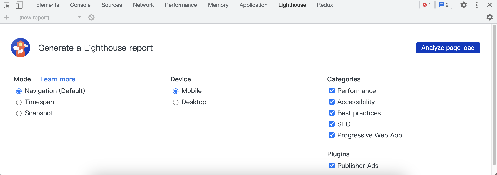

# 性能优化
前端性能优化是提高用户体验、提高网站可用性、降低成本和维护成本的必要步骤。当网站响应速度较慢时，用户体验会受到严重影响，导致用户可能会放弃使用该网站，转而寻找其他更快速、更可靠的替代品。优化前端性能可以加快页面加载速度、提高页面响应速度，减少资源加载时间和请求次数，从而为用户提供更好的体验。此外，优化前端性能还可以减少服务器的负载，降低服务器的成本和维护成本。

## 分析工具
如果要对页面进行性能优化，那么要先对当前页面进行分析，查找出页面性能的短板，根据分析结果进行针对性优化。

Lighthouse 是一个网站性能测评工具， 它是 Google Chrome 推出的一个开源自动化工具，能够对 PWA 和网页多方面的效果指标进行评测，并给出最佳实践的建议以帮助开发者改进网站的质量。它的使用方法也非常简单，我们只需要提供一个要测评的网址，它将针对此页面运行一系列的测试，然后生成一个有关页面性能的报告。通过报告我们就可以知道需要采取哪些措施来改进应用的性能和体验。

Google提供了多种LightHouse使用方案：
1. 通过Chrome浏览器提供的DevTools使用。在Chrome浏览器中，你可以通过查看DevTools的LightHouse。
  
Categories 用于配置需要分析的事项，Device用于配置本次测试设备类型。在完成所有配置后，点击”Analyze page load“按钮即可对当前页面进行分析测试。
2. 通过Chrome浏览器插件使用。访问Chrome Web Store，搜索LightHouse进行安装。
3. 通过PageSpeed Insights(PSI)进行在线测试。PSI会报告网页在移动设备和桌面设备上的用户体验，并提供关于如何改进网页的建议。
4. 通过官方发布的npm包使用。相比较前三种方式，该方式的自定义程度更高，可以将更多的配置项进行灵活组合，得到更丰富的分析数据和结果。
### npm包调用
首先，需要在本地安装 Node.js 和 npm。然后，打开命令行界面并运行以下命令：
```bash
npm install -g lighthouse
```
接下来，可以使用以下命令运行 Lighthouse：
```bash
lighthouse <url>
```
其中 `<url>` 是要测试的网站的 URL。运行此命令将生成一个包含有关网站性能的报告。

作为一个模块，Lighthouse可以通过Node.js的API在代码中调用。这使得我们可以将Lighthouse集成到自动化流程中，例如在CI/CD流程中或与其他工具一起使用。
```js
const lighthouse = require('lighthouse');
const chromeLauncher = require('chrome-launcher');

// 配置项
const opts = {
  onlyCategories: ['performance'],
  port: 9222,
  output: 'html',
};

// 使用Chrome作为Lighthouse的渲染引擎
chromeLauncher
  .launch({ chromeFlags: ['--headless'] })
  .then(chrome => {
    opts.port = chrome.port;
    return lighthouse('https://example.com', opts);
  })
  .then(results => {
    console.log(results.report);
    return chrome.kill();
  })
  .catch(error => console.error(error));
```

这个示例首先使用chrome-launcher启动一个headless Chrome实例。然后，我们通过指定一个URL和一些选项，使用Lighthouse分析该URL的性能。分析结果以HTML形式输出。最后，我们使用chrome.kill()方法结束Chrome实例。

在上面的示例中，我们使用了onlyCategories选项来指定我们只关心性能指标。你可以通过lighthouse.defaultCategories获得默认类别列表，或通过自己的配置文件定义自定义类别。同时，output选项还支持其他输出格式，例如JSON、CSV等。

需要注意的是，Lighthouse需要在Chrome的上下文中运行，因此需要启动一个Chrome实例。同时，由于Lighthouse会执行一些复杂的操作，因此需要占用一定的系统资源，所以我们需要确保有足够的内存和CPU来运行Lighthouse分析。

## CDN加速
CDN（Content Delivery Network，内容分发网络）是一种可以将静态资源缓存在分布式节点上，以提高访问速度和降低服务器压力的解决方案。前端使用CDN加速可以减少页面加载时间，提高用户体验。

使用CDN加速的步骤如下：

1. 选择CDN服务提供商并注册账号，例如阿里云、腾讯云、七牛云等。
2. 在CDN服务商控制台中创建加速域名，并将需要加速的静态资源上传至CDN服务商提供的存储空间中。
3. 配置域名解析，将原有的资源访问路径替换成CDN服务商提供的加速域名。

::: tip
使用CDN加速时要确保资源的版本号更新，避免缓存问题影响用户体验。此外，对于一些敏感数据或动态渲染的页面，不建议使用CDN加速，以保证数据安全性和正确性。
:::

## 按需加载
按需加载（Lazy Loading）可以帮助优化前端应用的性能，它允许你将一些不必要的代码延迟加载，只有在需要的时候才加载。

动态导入是指将一些模块通过异步加载的方式来延迟加载，只有在需要时才会加载。Webpack 2.0以上版本已经原生支持了动态导入，你可以使用import()函数实现。例如：
```js
import('./module').then(module => {
  // do something with module
});
```
这段代码将在需要时异步加载'module'模块。

## 服务端渲染
前后端开始分离后，浏览器在加载页面时通常先加载index.html，再根据index.html中的内容加载对应的JavaScript bundle，最后执行JavaScript 代码，从而将整个页面渲染出来。期间可能还有发起接口请求对应的数据，整个渲染的链路较长。当用户网络情况较差时，就会有大量的等待时间。

服务端渲染就是为了解决这个问题而出现的，它会在服务端执行JavaScript代码，完成整个页面的HTML初始化过程，并执行对应的接口请求、填充数据。在用户发起页面请求时，返回的相应结果是可以交互的，省去了HTML解析、JavaScript bundle加载及获取数据等流程，大大的提升了浏览器速度和用户体验。

服务端渲染不仅能够有效提高首屏加载速度，也更有利于SEO。传统的爬虫程序大多数不会执行JavaScript代码，只根据HTML文件中的内容进行解析，而服务端渲染直接将有效信息填充到了HTML中，方便爬虫程序进行检索。

当然服务端渲染也有缺点。因为将浏览器的解析工作转移到了服务器，所以会占用大量的服务器资源，增加设备的压力。服务端渲染对JavaScript代码也有限制，例如，不能使用BOM、DOM等私有方法。